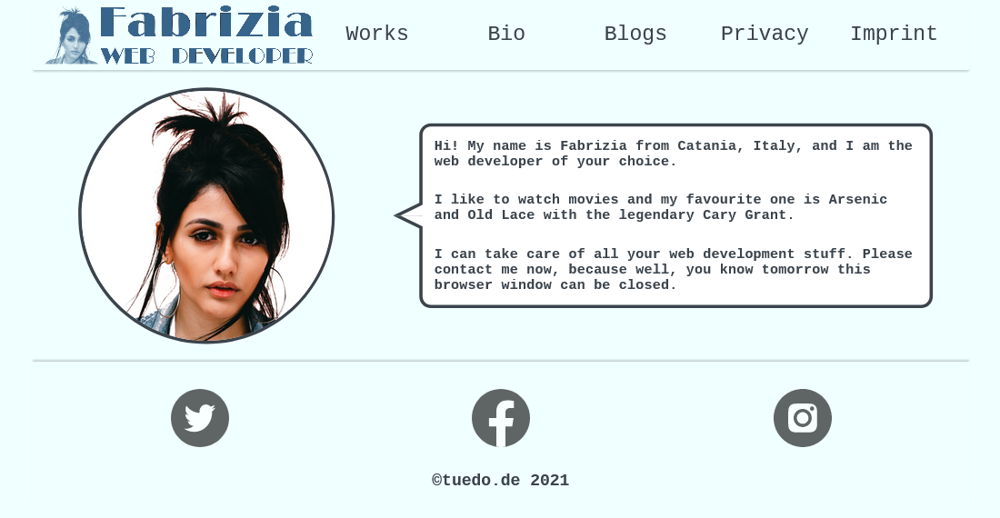

# Nifty portfolio website template with CSS and Vanilla Javascript

Use watch Sass and live server for development.

[CodePen Demo](https://codepen.io/tuedodev/pen/gOmXZVY) with slightly different code base due to codepen.io requirements.
